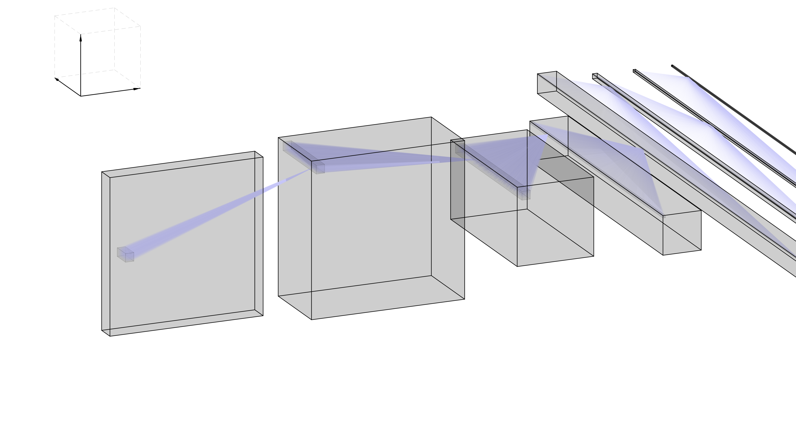

# Plot deep neural network architectures to scale (same units for height, width, features). &nbsp;
&nbsp;

&nbsp;
Run main.m to plot a demo figure. &nbsp;
Tweak demo network to change the layer's dimensions, the locations of the visualized units and their corresponding receptive fields. &nbsp;
&nbsp;
If you use this for talks/posters/papers, please cite: &nbsp;
[Kriegeskorte, Nikolaus, and Tal Golan. "Neural network models and deep learning." Current Biology 29.7 (2019): R231-R236.](https://www.sciencedirect.com/science/article/pii/S0960982219302040?dgcid=api_sd_search-api-endpoint) &nbsp;
&nbsp;
Export code credit: [https://github.com/altmany/export_fig](https://github.com/altmany/export_fig)